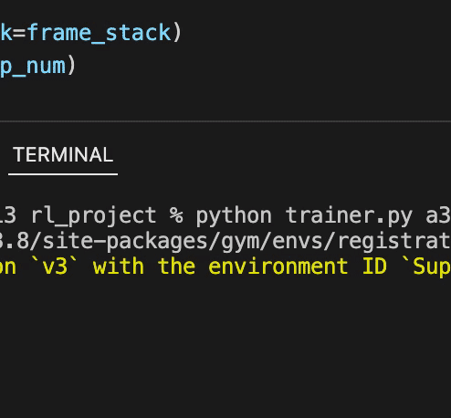

## Asynchronous RL Algorithms for Super Mario Bros


### Setup
Ensure all dependencies in requirements.txt are installed. 
### To run a demo
```
python trainer.py a3c -p 0 -r --model_file experiments/exp1/a3c_best.pt
```

### To train
```
python trainer.py <algorithm of choice>
```

Algorithm choices: "a3c", "qlearn", and "nqlearn"

Action space choices: "right_only", "easy_movement", "simple_movement", "complex_movement", default is right only

Environment names are specified by Gym Super Mario Bros., default is SuperMarioBros-1-1-v0

Other arguments:
* ```-p```, ```--processes```: specify number of training threads, default is 4 (use 0 for evaluation only)
* ```-r```, ```--render```: flag that specifies to render gameplay from the evaluator
* ```--model_file```: specify a .pt file as the starting model, some examples are available in experiments directory. Make sure the correct environment and action space for that model is specified.
* ```--tmax```: specify the maximum number of training steps, default is 6 million

Training logs are written to ```<algorithm>.log``` in the logs directory, and model files are periodically saved to the saves directory.

Example: 

```
python trainer.py a3c
```

Example of playing World 1-1 with a fully trained model:

```
python trainer.py -r -p 0 a3c --actions easy_movement --model_file experiments/exp2/a3c_best_easy_movement.pt
```

Other interesting demos:
```
python trainer.py -r -p 0 a3c --env SuperMarioBros-1-4-v0 --model_file experiments/exp3/a3c_1_4.pt
```

```
python trainer.py -r -p 0 a3c --env SuperMarioBros-4-1-v0 --model_file experiments/exp3/a3c_4_1.pt
```

```
python trainer.py -r -p 0 a3c --env SuperMarioBros-1-2-v0 --model_file experiments/exp3/a3c_1_2.pt
```

[Gym Super Mario Bros. Environment](https://github.com/Kautenja/gym-super-mario-bros)
